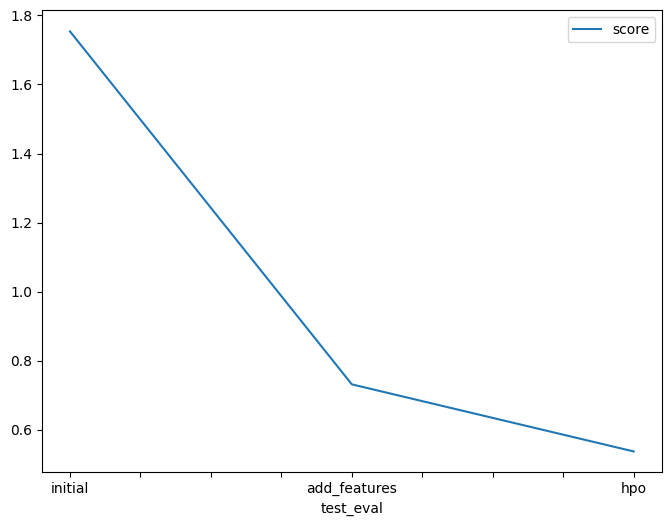

# Report: Predict Bike Sharing Demand with AutoGluon Solution
#### Raghuraj Pratap Yadav

## Initial Training
### When attempting to submit predictions, I realized that negative values were present in the output, which needed to be removed to submit the results.

### The top-ranked model that performed was the WeightedEnsemble_L3.

## Exploratory data analysis and feature creation
### Exploratory analysis revealed insights such as the impact of weather and season on bike demand. Additional features were created by converting weather and season columns to categorical variables and adding an hours column.

### After adding additional features, the model performance improved significantly from an initial score of 1.75354 to 0.73169.

## Hyperparameter tuning
### Despite trying different hyperparameters, the model performance did not improve significantly.

### If given more time with this dataset, I would focus on hyperparameter tuning and experimenting with various configurations.

### Table of model performance:
| Model        | HPO1    | HPO2    | HPO3    | Score   |
|--------------|---------|---------|---------|---------|
| Initial      | Default | Default | Default | 1.75354 |
| Add Features | Default | Default | Default | 0.73169 |
| HPO          | HPO     | KNN     | RF      | 0.5375  |

### Line plot showing the top model score for the three training runs during the project:

### Line plot showing the top Kaggle score for the three prediction submissions during the project:

## Summary
Despite the challenges faced, such as negative values in predictions and modest improvements after hyperparameter tuning, the model's performance significantly improved after adding additional features. Continuous refinement and experimentation with hyperparameters are essential for further enhancements.

